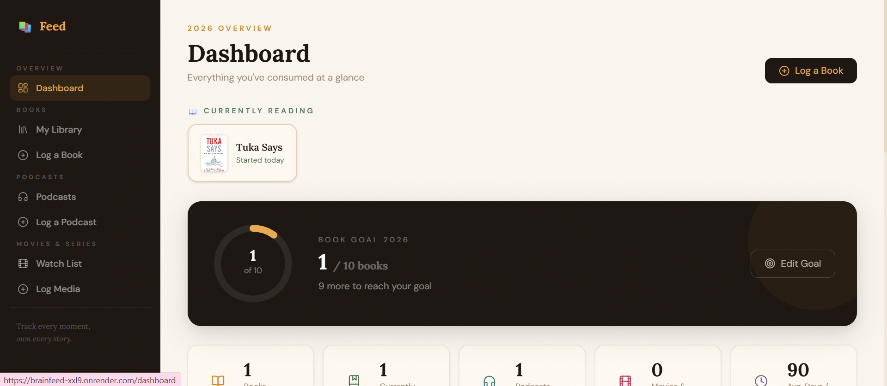
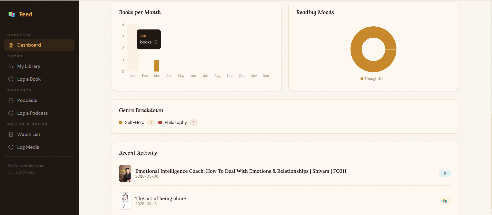
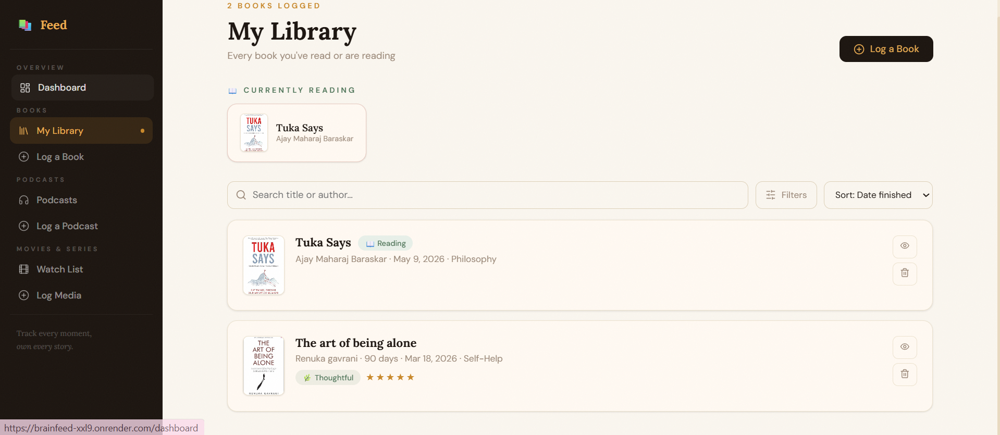
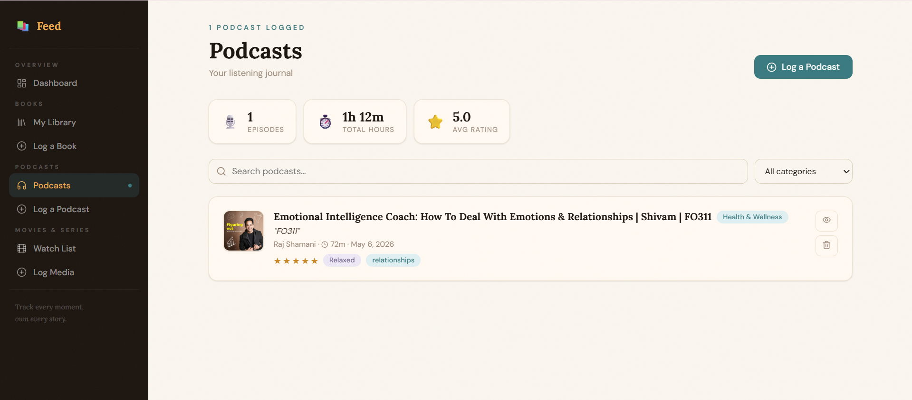
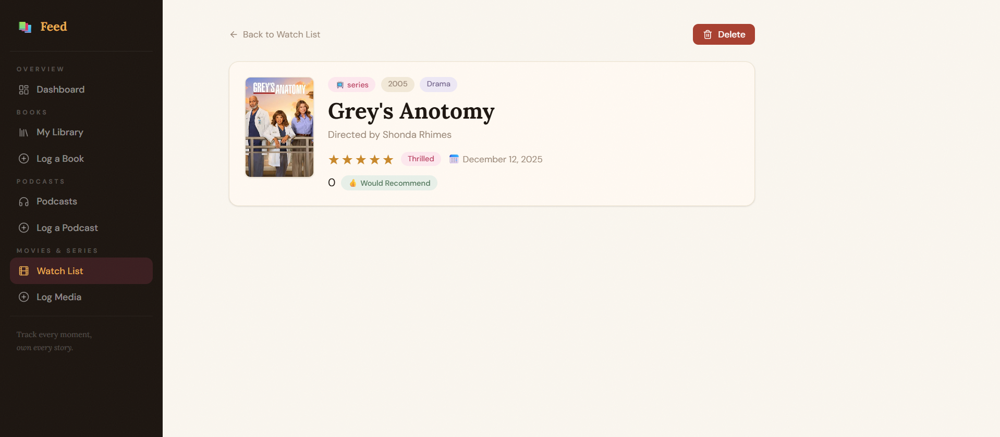
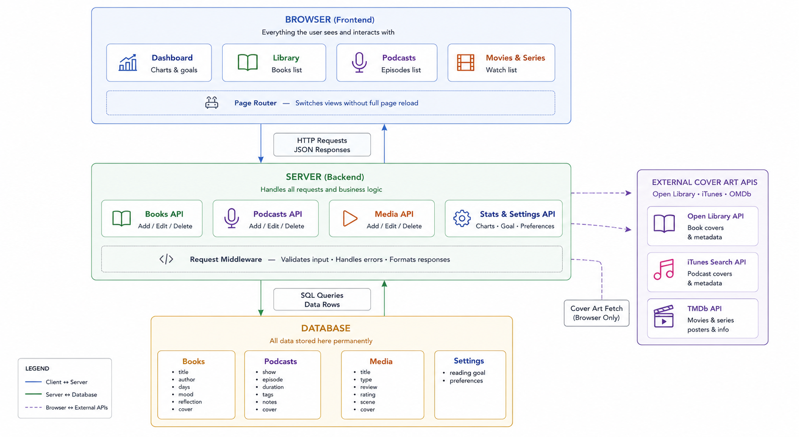

# 📚 Brainfeed — Books, Podcasts & Media Tracker

> Track everything that feeds your brain — books, podcasts, movies & series — in one place.
> ## Live Demo 
https://brainfeed-xxl9.onrender.com
## What is Brainfeed?

A personal media diary. Log what you read, listen to, and watch. Add your thoughts, mood, and reflections. See it all visualised on a dashboard with charts and a yearly goal tracker.

---
## Screenshots 

### Dashboard




### Books Library


### Podcasts


### Media Tracker



## Features

**📚 Books**
- Log with status — *Currently Reading* or *Finished*
- Track days taken, mood, summary, personal reflection
- Star rating, genre, auto-fetched cover art (Open Library)
- Yearly reading goal with animated circular progress ring

**🎙️ Podcasts**
- Log show, episode, host, duration, category
- Add notes, key takeaways, custom tags
- Auto-fetch cover art from iTunes

**🎬 Movies & Series**
- Log movies, series, documentaries, anime
- Write full review + favourite scene
- Rewatched and Would Recommend toggles
- Auto-fetch poster from OMDb

**📊 Dashboard**
- Books/month bar chart, mood pie chart, genre breakdown
- Stats: total books, avg days, fastest read, podcasts, media
- Recent activity feed across all content types

---

## Tech Stack

| Layer | Technology |
|---|---|
| Frontend | React 18, Vite 5, React Router v6, Recharts |
| Backend | Node.js, Express 4 |
| Database | SQLite via better-sqlite3 |
| Icons | Lucide React |
| Deployment | Railway / Render |

---


## Project Structure

```
brainfeed/
├── client/               # React frontend (Vite)
│   └── src/
│       ├── components/   # UI primitives, Layout, BookForm
│       ├── hooks/        # useBooks, usePodcasts, useMedia, useStats
│       ├── pages/        # Dashboard, Library, Podcasts, MediaList...
│       └── utils/        # api.js, constants.js
├── server/
│   └── index.js          # Express routes + SQLite setup
├── railway.toml          # Railway deploy config
└── render.yaml           # Render deploy config
```

---

## API Endpoints

| Method | Endpoint | Description |
|---|---|---|
| GET/POST | `/api/books` | List or create books |
| GET/PUT/DELETE | `/api/books/:id` | Read, update, delete a book |
| GET/POST | `/api/podcasts` | List or create podcasts |
| GET/PUT/DELETE | `/api/podcasts/:id` | Read, update, delete a podcast |
| GET/POST | `/api/media` | List or create media |
| GET/PUT/DELETE | `/api/media/:id` | Read, update, delete media |
| GET | `/api/stats?year=` | Dashboard stats for a year |
| GET/PUT | `/api/settings` | Read or update settings |

---

## System Architecture
<p align="center">
  
</p>

## Deployment

### Render
Connect repo → Render reads `render.yaml` automatically → Add disk at `/var/data`.

---

## Cover Art APIs

| Content | API | Key Required |
|---|---|---|
| Books | Open Library | No |
| Podcasts | iTunes Search | No |
| Movies | OMDb | No (free tier) |

All APIs are called client-side. Falls back to emoji placeholder if unavailable.

---

## License

MIT — free to use, modify, and deploy.
